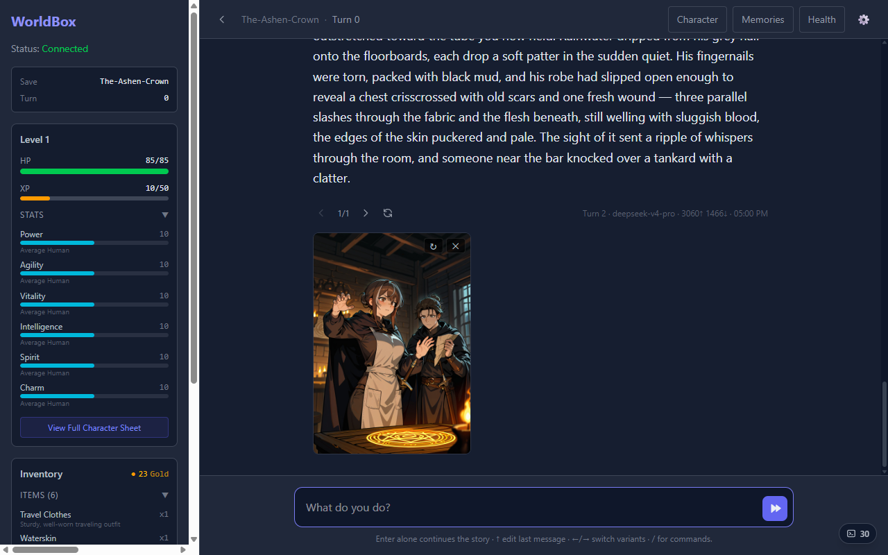
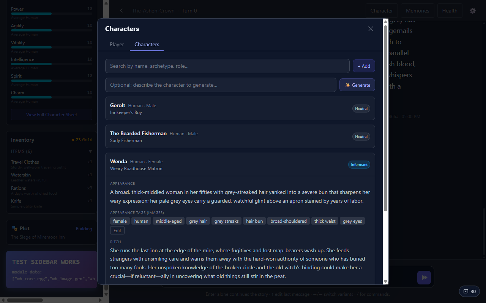
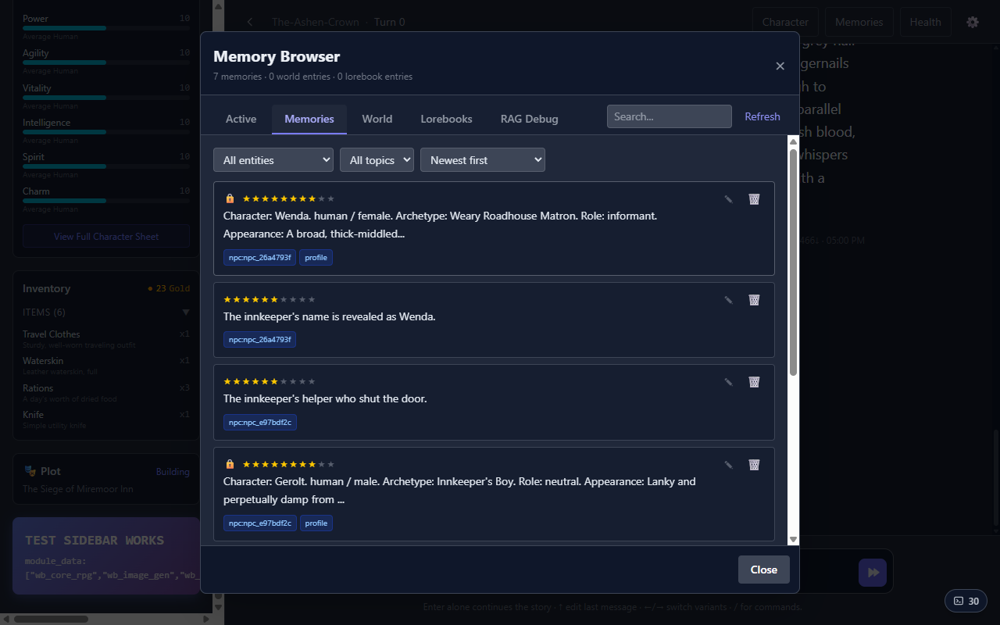
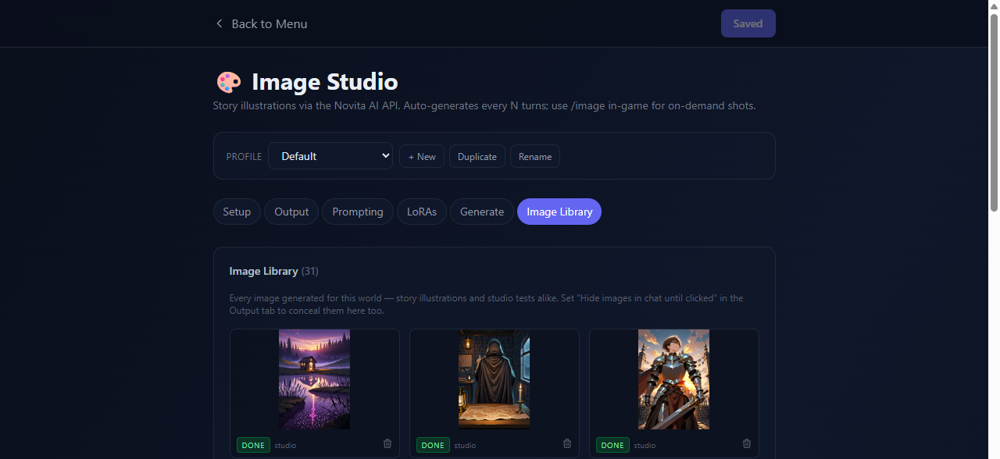
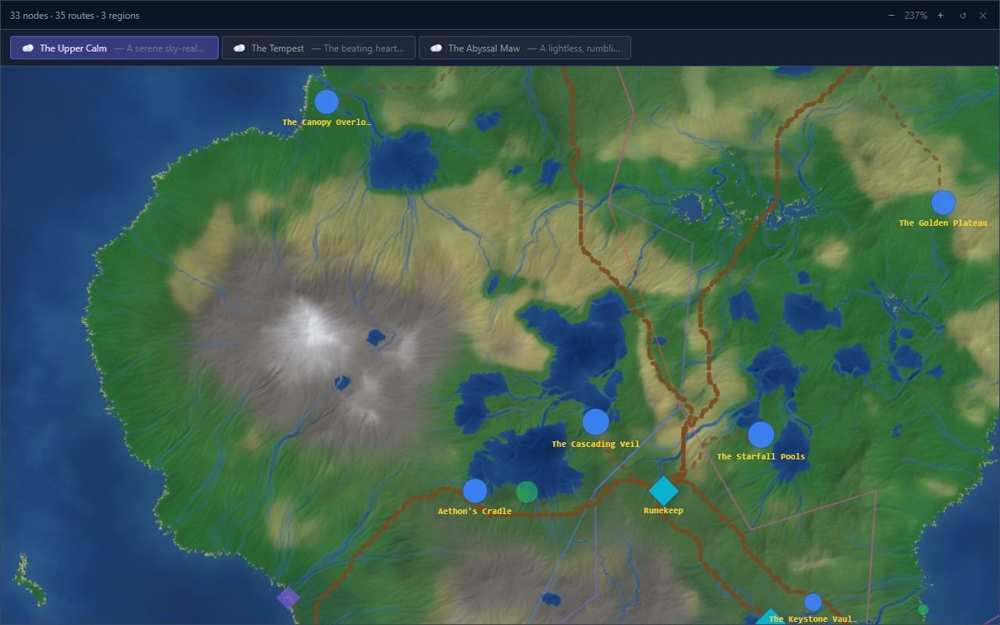

# WorldBox

**A modular, AI-driven text roleplaying engine — a multi-agent storyteller with real game mechanics, enforced by pluggable Python modules.**

🌐 **[Project page](https://flippripp.github.io/WorldboxAI/)** · 📚 [Documentation](docs/index.md) · 🚀 [Quick Start](#quick-start)


## The story is written by an AI. The rules are not.

A heavyweight storyteller LLM streams cinematic prose. A fast reader agent extracts what actually
happened into structured state changes. Sandboxed Python modules — stats, inventory, NPCs, time,
plot — apply the mechanics, and can **veto and rewrite** the narration when it cheats: spends gold
you don't have, contradicts your character sheet, or hands you items from nowhere.



*The story view: streamed narration with dialogue highlighting, the live character sheet and
inventory in the sidebar, and a character-consistent illustration generated for the scene.*

## What's in the box

- **Multi-agent turn loop** — a LangGraph pipeline: slash-command router → parallel module context
  gathering → streaming storyteller → JSON-extracting reader → module state mutations, with a
  validation-veto rewrite loop when a module rejects the narration.
- **Vector memory (RAG)** — every scene is embedded with importance scoring and recency bias, and
  retrieved into context when relevant. Browse, edit and debug it in the built-in memory browser.
- **NPC capture** — characters the story invents in passing become full tracked records: appearance,
  personality, role, and image tags so illustrations stay consistent.
- **Story illustrations** — auto-generated every few turns (or `/image` on demand) through the
  Novita AI cloud or any local A1111/Forge-compatible Stable Diffusion server, with one-click model
  installs, hires-fix and v-pred checkpoint support.
- **AI world generation** — describe a world; the engine generates rules, lore, regions and terrain
  with its own map UI, usable as the setting for any story.
- **Saves, branching, undo** — zip-archived saves with isolated per-module state, branch from any
  message, snapshot-based undo including vector-memory rollback.
- **Any LLM provider** — LiteLLM routing with per-role model slots (storyteller / reader / embeddings /
  fast module helper); mix providers freely, inspect every call in the LLM inspector.
- **Prompt Studio** — the entire prompt pipeline is visible and editable: drag blocks, toggle module
  injections, preview the exact context the storyteller receives.
- **Runs anywhere** — FastAPI backend + React frontend: desktop, LAN play from a phone, or fully
  on-device via Termux on Android.

### The world remembers

| NPC capture | Memory browser |
| --- | --- |
|  |  |
| The innkeeper only existed in prose — the NPC System turned her into a tracked character, image tags included. | Importance-starred memories with entity tags and a RAG debug view. |

### Illustrated as you play



*Image Studio: generation profiles, cloud/local provider switching, prompt templates per model
family, and an image library of everything generated for the world.*

### AI world generation



## Modules

Game mechanics live in sandboxed Python modules with a strict manifest contract: they declare what
state they consume and produce, run in dependency-ordered parallel tiers each turn, and ship their
own React widgets, settings, slash commands and prompt blocks. Delete one and the engine keeps
running. See [docs/MODULES.md](docs/MODULES.md) for the SDK.

| Module | What it does |
| --- | --- |
| `wb_core_rpg` | Stats, skills, XP and levels, HP and status effects — the character sheet in the sidebar |
| `wb_inventory` | Items and money; narration that spends what you don't have gets vetoed and rewritten |
| `wb_npc_system` | Captures story characters as full NPC records and generates fresh faces over time |
| `wb_plot_director` | Profiles your play style and weaves evolving, quality-checked plot threads |
| `wb_character_tracker` | Records lasting changes to the player's appearance, identity and personality |
| `wb_image_gen` | Story illustrations via cloud or local Stable Diffusion, with character consistency |
| `wb_time_tracker` | Tracks in-world date and time as the story advances |
| `wb_worldgen` | AI world generation: regions, terrain, travel — with its own map UI |

## Quick Start

```powershell
# Install backend
python -m venv venv
.\venv\Scripts\Activate.ps1
pip install -r requirements.txt
Copy-Item backend\.env.example backend\.env
# Edit backend/.env with your GEMINI_API_KEY

# Install frontend
cd frontend
npm install

# Run both
.\start.bat
```

On Linux/macOS:

```bash
# Install backend
python3 -m venv venv
./venv/bin/pip install -r requirements.txt
cp backend/.env.example backend/.env
# Edit backend/.env with your GEMINI_API_KEY

# Install frontend
cd frontend && npm install && cd ..

# Run both
./start.sh
```

Both start scripts pull the latest changes from git on launch (skipped gracefully if offline) and
refresh pip/npm dependencies when an update was pulled.

## Image Generation

Story illustrations render through either the Novita AI cloud API or a local
A1111/Forge-compatible Stable Diffusion WebUI (started with `--api`), switched
in the Image Studio main-menu screen. `modules/wb_image_gen/image_server.bat`
/ `image_server.sh` set up and start the local server (clone SD WebUI Forge,
install its dependencies, launch with the right flags) in one command. See
[docs/SETUP.md](docs/SETUP.md#image-generation-optional).

## Documentation

See [docs/index.md](docs/index.md) for full documentation including:
- [Setup guide](docs/SETUP.md)
- [Task list & priorities](docs/TaskList.md)
- [Architecture & design](docs/WorldboxTDD.md)
- [Module contract](docs/MODULES.md)
- [Implementation plans](docs/TaskList.md#implementation-plans)

## Testing

```powershell
# Deterministic backend tests (no API key needed)
.\venv\Scripts\python.exe -m pytest

# Build frontend
cd frontend
npm run build
```
